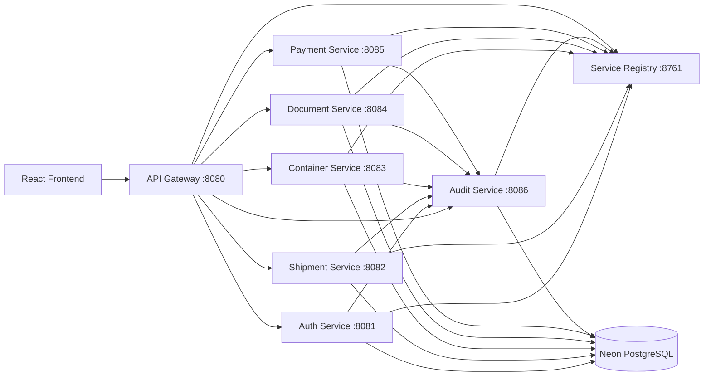

# CargoSphere

CargoSphere is a full-stack cargo and shipment management platform built with a Spring Boot microservices architecture and a React frontend.

## Architecture



## Backend Services

| Service | Port | Responsibility |
|---|---:|---|
| API Gateway | 8080 | Central routing and Swagger aggregation |
| Auth Service | 8081 | Registration, login, JWT authentication, users and roles |
| Shipment Service | 8082 | Shipment lifecycle, cargo details and shipment events |
| Container Service | 8083 | Container types and shipment-container allocations |
| Document Service | 8084 | Document checklist and verification |
| Payment Service | 8085 | Payment creation, status updates and refunds |
| Audit Service | 8086 | Centralized audit logging |
| Service Registry | 8761 | Eureka service discovery |

## Technology Stack

### Backend

- Java 21
- Spring Boot
- Spring Security
- JWT
- Spring Data JPA
- Hibernate
- Spring Cloud Gateway
- Netflix Eureka
- Flyway
- PostgreSQL / Neon
- Maven
- JUnit 5
- Mockito
- OpenAPI / Swagger
- Docker and Docker Compose
- GitHub Actions

### Frontend

- React
- Vite
- JavaScript
- HTML
- CSS

## Security

- Stateless JWT authentication
- Role-based authorization using `ROLE_ADMIN` and `ROLE_CLIENT`
- Internal API-key authentication for service-to-service audit events
- Centralized CORS configuration at the API Gateway
- Secrets loaded through environment variables

## Run with Docker

### 1. Create environment file

```powershell
Copy-Item .\.env.example .\.env
```

Fill in the database credentials and secrets.

Do not commit `.env`.

### 2. Validate Docker Compose

```powershell
docker compose config
```

### 3. Build and start

```powershell
docker compose up --build -d
```

### 4. Check status

```powershell
docker compose ps
```

### 5. Stop

```powershell
docker compose down
```

## Local URLs

- API Gateway: `http://localhost:8080`
- Central Swagger UI: `http://localhost:8080/swagger-ui.html`
- Eureka Dashboard: `http://localhost:8761`

## Testing

Run tests for one service:

```powershell
cd .\services\auth-service
.\mvnw.cmd clean test "-Dspring.profiles.active=test"
```

GitHub Actions automatically tests all eight backend modules, validates Docker Compose, and builds Docker images on pushes and pull requests to `develop` and `main`.

## Git Workflow

```text
feature/* -> develop
develop -> main through Pull Request
```

## Repository Structure

```text
services/
  auth-service/
  shipment-service/
  container-service/
  document-service/
  payment-service/
  audit-service/
  service-registry/
  api-gateway/

docker-compose.yml
.env.example
.github/workflows/backend-ci.yml
```

## Team

- Dnyanesh Gholap — Project Lead and Backend Developer
- Ajay — Shipment Service
- Pranit — Container Service
- Aayush — Payment Service
- Pranav — Document Service

## API Documentation

Start the complete backend and open:

```text
http://localhost:8080/swagger-ui.html
```

Use the service selector to view APIs for auth, shipment, container, document, payment and audit services.

## License

This project was developed for academic and learning purposes.
